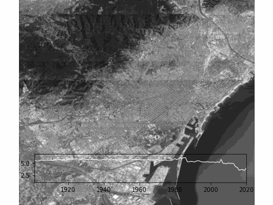

# Eixample energy

Eixample energy is a project of data visualization to analyze energy consumption in Barcelona and more precisely in the Eixample district.
It was developed as part of the 
[Master in City and Technology - IAAC](https://iaac.net/educational-programmes/masters-programmes/master-in-city-technology/)
by:
- Alvaro Cerezo
- Leyla Saadi
- Mario Gonzalez
- Inigo Esteban Marina
- Tugdual Sarazin

## Development

It included a small internal library to abstract [Matplotlib](https://matplotlib.org/) functions (source code: [drawers](EixampleEnergy/drawers)) and the code to generate [data visualizations](EixampleEnergy/).

It's based on 3 main libraries:
- [Matplotlib](https://matplotlib.org/) to manage animations and scatter plots
- [geopandas](https://geopandas.org/) to draw maps
- [Contextily](https://contextily.readthedocs.io/en/latest/index.html) to donwload and display the background image of maps

## Data
[Data]() has been 
**Sources:**
- https://ine.es/en/
- https://analisi.transparenciacatalunya.cat/en/Energia/Certificats-d-efici-ncia-energ-tica-d-edificis/j6ii-t3w2
- http://simuladoredificis.icaen.gencat.cat/

